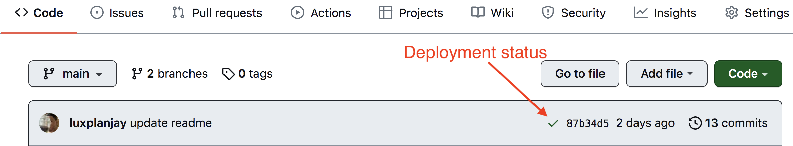

Тестове завдання
Створити застосунок для компанії, що надає послуги надання в Україні автомобілів в оренду. Застосунок складається з 3х сторінок:

- домашня сторінка з загальним описом послуг, що надає компанія. Стилізація та оформлення на ваш розсуд.
- сторінка, що містить каталог автівок різної комплектації, які користувач може фільтрувати за маркою, ціною за годину оренди авто та кількістю кілометрів, яку подолав автомобіль під час його експлуатації (пробіг).
- сторінка з оголошеннями, які були додані користувачем в улюблені Зовнішній вигляд програми повинен складатися з cайдбару та області перегляду.
Технічне завдання

1. Відповідно до макету реалізувати картку оголошення про здачу авто в оренду.
2. На першій сторінці каталогу має рендеритися 8 оголошень, а їх решта - по кліку на кнопку Load more.
3. У разі кліку по кнопці у вигляді “серця” на картці оголошення воно має додаватися до списку улюблених, а колір кнопки змінюватися.
4. При оновленні сторінки має фіксуватись кінцевий результат дій користувача. Тобто, якщо додати оголошення в улюблені та оновити сторінку - то кнопка все одно залишається в стані “улюбленого оголошення” із відповідним кольором.
5. У разі повторного кліку по кнопці у вигляді “серця” оголошення повинно бути видалене зі списку улюблених, а колір кнопки змінитись до початкового стану.
6. У разі кліку по кнопці Learn more має відкриватись модальне вікно з детальною інформацією про авто та умови його оренди.
7. Модальне вікно повинно закриватись по кліку на кнопку у вигляді “хрестика”, по кліку на backdrop або натисканню на клавішу Esc.
8. В коді пробіг авто має бути прописаний одним значенням (наприклад, 4500). В UI - виведено через кому (4,500).
9. Кнопку Rental car слід реалізувати як посилання, що надаватиме можливість користувачу зʼєднатись з компанією за номером телефону +380730000000.
Створи маршрутизацію, використовуючи React Router. У застосунку повинні бути такі маршрути:

- “/” - домашня сторінка з загальним описом послуг, що надає компанія
- “/catalog” - сторінка, що містить каталог автівок різної комплектації
- “/favorites” - сторінка з оголошеннями, які були додані користувачем в улюблені Якщо користувач зайшов за маршрутом, якого не існує, його необхідно перенаправляти на домашню сторінку.
Для роботи зі списком оголошень створи свій персональний бекенд для розробки за допомогою UI-сервісу https://mockapi.io/. Створи ресурс adverts. Використай конструктор ресурсу та опиши об'єкт оголошення, як описано нижче.

Advert

1. Створіть advert в Mockapi з наступними полями: id, year, make, model, type, img, description, fuelConsumption, engineSize, accessories, functionalities, rentalPrice, rentalCompany, address, rentalConditions, mileage (див. скріншот нижче). Для наповнення колекції можна взяти adverts.json
https://textbook.edu.goit.global/lms-career-homework/img/2.png
2. Зображення авто можете підібрати самостійно.
3. В базі має бути від 32 оголошень з різними значеннями (на ваш розсуд). Реалізована пагінація, де одна сторінка пагінації повинна вміщати 8 оголошень.
Додаткове завдання Додай фільтрацію: dropdown із марками автомобіля makes.json - показати оголошення з автівками відповідної марки dropdown із цінами за годину оренди авто (крок 10$) - показати оголошення з автівками, ціна за оренду яких належить до діапазону цін, обраних користувачем група inputів для визначення діапазону пробігу, в межах якого користувач шукатиме оголошення

Критерії виконання ● Верстка фіксована в рх, семантична та валідна. ● Немає помилок в консолі браузера. ● Інтерактивність працює відповідно до технічного завдання. ● Код відформатований та без коментарів. ● В репозиторії має бути описаний README.md. ● Проєкт задеплоїний на github pages або netlify.com.

# React homework template

Этот проект был создан при помощи
[Create React App](https://github.com/facebook/create-react-app). Для знакомства
и настройки дополнительных возможностей
[обратись к документации](https://facebook.github.io/create-react-app/docs/getting-started).

## Создание репозитория по шаблону

Используй этот репозиторий организации GoIT как шаблон для создания репозитория
своего проекта. Для этого нажми на кнопку `«Use this template»` и выбери опцию
`«Create a new repository»`, как показано на изображении.


На следующем шаге откроется страница создания нового репозитория. Заполни поле
его имени, убедись что репозиторий публичный, после чего нажми кнопку
`«Create repository from template»`.


После того как репозиторий будет создан, необходимо перейти в настройки
созданного репозитория на вкладку `Settings` > `Actions` > `General` как
показано на изображении.


Проскролив страницу до самого конца, в секции `«Workflow permissions»` выбери
опцию `«Read and write permissions»` и поставь галочку в чекбоксе. Это
необходимо для автоматизации процесса деплоя проекта.


Теперь у тебя есть личный репозиторий проекта, со структурой файлов и папок
репозитория-шаблона. Далее работай с ним как с любым другим личным репозиторием,
клонируй его себе на компьютер, пиши код, делай коммиты и отправляй их на
GitHub.

## Подготовка к работе

1. Убедись что на компьютере установлена LTS-версия Node.js.
   [Скачай и установи](https://nodejs.org/en/) её если необходимо.
2. Установи базовые зависимости проекта командой `npm install`.
3. Запусти режим разработки, выполнив команду `npm start`.
4. Перейди в браузере по адресу [http://localhost:3000](http://localhost:3000).
   Эта страница будет автоматически перезагружаться после сохранения изменений в
   файлах проекта.

## Деплой

Продакшн версия проекта будет автоматически проходить линтинг, собираться и
деплоиться на GitHub Pages, в ветку `gh-pages`, каждый раз когда обновляется
ветка `main`. Например, после прямого пуша или принятого пул-реквеста. Для этого
необходимо в файле `package.json` отредактировать поле `homepage`, заменив
`your_username` и `your_repo_name` на свои, и отправить изменения на GitHub.

```json
"homepage": "https://your_username.github.io/your_repo_name/"
```

Далее необходимо зайти в настройки GitHub-репозитория (`Settings` > `Pages`) и
выставить раздачу продакшн версии файлов из папки `/root` ветки `gh-pages`, если
это небыло сделано автоматически.


### Статус деплоя

Статус деплоя крайнего коммита отображается иконкой возле его идентификатора.

- **Желтый цвет** - выполняется сборка и деплой проекта.
- **Зеленый цвет** - деплой завершился успешно.
- **Красный цвет** - во время линтинга, сборки или деплоя произошла ошибка.

Более детальную информацию о статусе можно посмотреть кликнув по иконке, и в
выпадающем окне перейти по ссылке `Details`.



### Живая страница

Через какое-то время, обычно пару минут, живую страницу можно будет посмотреть
по адресу указанному в отредактированном свойстве `homepage`. Например, вот
ссылка на живую версию для этого репозитория
[https://goitacademy.github.io/react-homework-template](https://goitacademy.github.io/react-homework-template).

Если открывается пустая страница, убедись что во вкладке `Console` нет ошибок
связанных с неправильными путями к CSS и JS файлам проекта (**404**). Скорее
всего у тебя неправильное значение свойства `homepage` в файле `package.json`.

### Маршрутизация

Если приложение использует библиотеку `react-router-dom` для маршрутизации,
необходимо дополнительно настроить компонент `<BrowserRouter>`, передав в пропе
`basename` точное название твоего репозитория. Слеш в начале строки обязателен.

```jsx
<BrowserRouter basename="/your_repo_name">
  <App />
</BrowserRouter>
```

## Как это работает


1. После каждого пуша в ветку `main` GitHub-репозитория, запускается специальный
   скрипт (GitHub Action) из файла `.github/workflows/deploy.yml`.
2. Все файлы репозитория копируются на сервер, где проект инициализируется и
   проходит линтинг и сборку перед деплоем.
3. Если все шаги прошли успешно, собранная продакшн версия файлов проекта
   отправляется в ветку `gh-pages`. В противном случае, в логе выполнения
   скрипта будет указано в чем проблема.